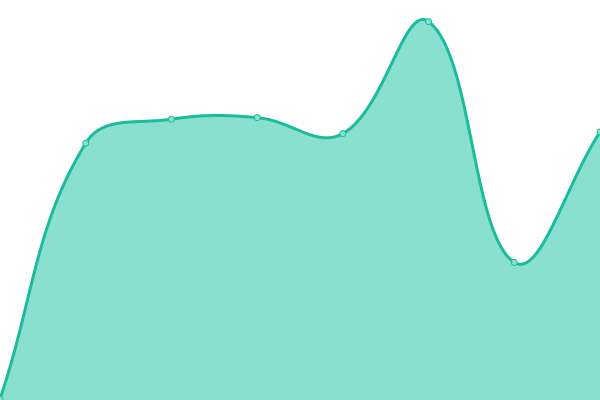
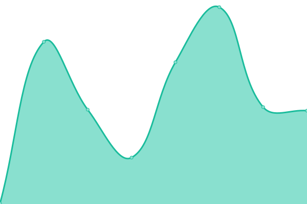
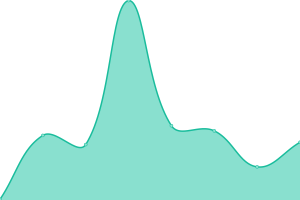
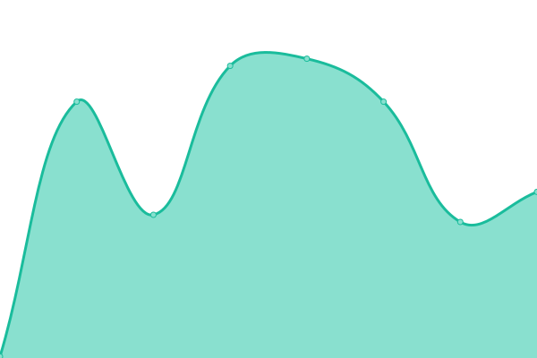
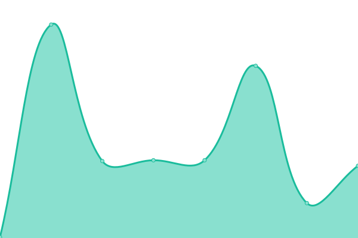

# [📈 Live Status](https://status.risksentinel.com): <!--live status--> **All Systems Operational**

This repository contains the open-source uptime monitor and status page for [zigbee-team](https://status.risksentinel.com), powered by [Upptime](https://github.com/upptime/upptime).

With [Upptime](https://upptime.js.org), you can get your own unlimited and free uptime monitor and status page, powered entirely by a GitHub repository. We use [Issues](https://github.com/zigbee-team/risksentinel-status/issues) as incident reports, [Actions](https://github.com/zigbee-team/risksentinel-status/actions) as uptime monitors, and [Pages](https://status.risksentinel.com) for the status page.

<!--start: status pages-->
<!-- This summary is generated by Upptime (https://github.com/upptime/upptime) -->
<!-- Do not edit this manually, your changes will be overwritten -->
<!-- prettier-ignore -->
| URL | Status | History | Response Time | Uptime |
| --- | ------ | ------- | ------------- | ------ |
|  [RiskSentinel API - Health Check](https://risksentinel.ai/health) | 🟩 Up | [risk-sentinel-api-health-check.yml](https://github.com/zigbee-team/risksentinel-status/commits/HEAD/history/risk-sentinel-api-health-check.yml) | 

 363ms
     
 | 

<a href="https://status.risksentinel.ai/history/risk-sentinel-api-health-check">100.00%</a>
    

|  [RiskSentinel API - Events Endpoint](https://api.risksentinel.ai/v1/events) | 🟩 Up | [risk-sentinel-api-events-endpoint.yml](https://github.com/zigbee-team/risksentinel-status/commits/HEAD/history/risk-sentinel-api-events-endpoint.yml) | 

 446ms
     
 | 

<a href="https://status.risksentinel.ai/history/risk-sentinel-api-events-endpoint">100.00%</a>
    

|  [RiskSentinel API - News Endpoint](https://api.risksentinel.ai/v1/news) | 🟩 Up | [risk-sentinel-api-news-endpoint.yml](https://github.com/zigbee-team/risksentinel-status/commits/HEAD/history/risk-sentinel-api-news-endpoint.yml) | 

 282ms
     
 | 

<a href="https://status.risksentinel.ai/history/risk-sentinel-api-news-endpoint">100.00%</a>
    

|  [RiskSentinel API - Topics Endpoint](https://api.risksentinel.ai/v1/topics) | 🟩 Up | [risk-sentinel-api-topics-endpoint.yml](https://github.com/zigbee-team/risksentinel-status/commits/HEAD/history/risk-sentinel-api-topics-endpoint.yml) | 

 91ms
     
 | 

<a href="https://status.risksentinel.ai/history/risk-sentinel-api-topics-endpoint">100.00%</a>
    

|  [RiskSentinel API - Sources Endpoint](https://api.risksentinel.ai/v1/sources) | 🟩 Up | [risk-sentinel-api-sources-endpoint.yml](https://github.com/zigbee-team/risksentinel-status/commits/HEAD/history/risk-sentinel-api-sources-endpoint.yml) | 

 136ms
     
 | 

<a href="https://status.risksentinel.ai/history/risk-sentinel-api-sources-endpoint">100.00%</a>
    

|  [RiskSentinel Main Website](https://risksentinel.ai) | 🟩 Up | [risk-sentinel-main-website.yml](https://github.com/zigbee-team/risksentinel-status/commits/HEAD/history/risk-sentinel-main-website.yml) | 

 76ms
     
 | 

<a href="https://status.risksentinel.ai/history/risk-sentinel-main-website">100.00%</a>
    

<!--end: status pages-->

[**Visit our status website →**](https://status.risksentinel.com)

## 📄 License

- Powered by: [Upptime](https://github.com/upptime/upptime)
- Code: [MIT](./LICENSE) © [Anand Chowdhary](https://anandchowdhary.com), supported by [Pabio](https://pabio.com)
- Data in the `./history` directory: [Open Database License](https://opendatacommons.org/licenses/odbl/1-0/)
